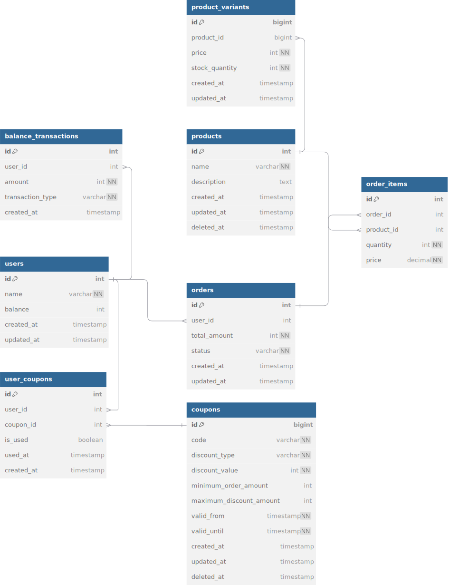

## 프로젝트

## Getting Started

### Prerequisites

#### Running Docker Containers

`local` profile 로 실행하기 위하여 인프라가 설정되어 있는 Docker 컨테이너를 실행해주셔야 합니다.

```bash
docker-compose up -d
```
---
## Milestone
### 마일스톤 링크: [Notion](https://www.notion.so/f9f21f9c7ade404e9d769986f7b2617e?pvs=4)

---
## 시퀀스 다이어그램


---
## 시스템 요구사항 정의

### 잔액 조회
* 유저 ID를 통해 잔액을 조회 할 수 있습니다.

### 잔액 충전
* 유저 ID를 통해 잔액을 충전 할 수 있습니다.
* 최소 만원 이상 단위부터 충전이 가능합니다.

### 상품 조회
* 상품의 ID를 통해 하나의 상품을 조회 할 수 있습니다.
* 별도 상품 ID값이 없을 경우 모든 상품을 조회 할 수 있습니다.
* 상품 조회 시 상품 이름, 상품 가격, 상품 재고 수량을 조회 할 수 있습니다.

### 상위 상품 조회
* 조회 시점의 최근 3일 동안 많이 판매된 상위 5개의 상품을 조회 할 수 있습니다.
* 상위 상품 조회 시 상품 이름, 상품 가격, 상품 판매 수량을 조회 할 수 있습니다.

### 상품 결제
* 유저 ID와 상품 ID 및 수량 정보, 쿠폰 사용 여부 정보가 담긴 값을 전달 받아 상품을 구매 할 수 있습니다.
* 상품 구매 시 상품 가격과 수량을 곱한 값을 잔액에서 차감하여 잔액을 업데이트 합니다.
* 상품 구매 시 쿠폰 사용 여부를 확인하여 쿠폰 할인 금액을 잔액에서 차감하여 잔액을 업데이트 합니다.
* 상품 구매 시 상품 재고 수량을 감소 시킵니다.
* 상품 구매 시 외부 데이터 플랫폼에 주문 정보를 전달 합니다.

### 선착순 쿠폰 발급
* 유저 ID를 통해 선착순 쿠폰을 발급 할 수 있습니다.
* 쿠폰 발급 시 요청 순서에 따라 쿠폰을 발급 해야 합니다.
* 쿠폰 발급 시 쿠폰 발급 수량을 초과하여 발급 요청 시 예외를 발생 시킵니다.
* 쿠폰은 고정 금액 혹은 비율 할인 쿠폰으로 존재 할 수 있습니다.
* 쿠폰은 특정 조건에 따라 사용 가능하도록 설정 할 수 있습니다. (주문 최소 금액, 최대 할인 금액)
* 쿠폰은 종류 당 최대 1개씩만 발급이 가능합니다.

## ERD


## API 명세서
* openapi.yaml 파일 참고
* https://editor.swagger.io/ -> File -> Import File -> 파일 선택