## 프로젝트

## Getting Started

### Prerequisites

#### Running Docker Containers

`local` profile 로 실행하기 위하여 인프라가 설정되어 있는 Docker 컨테이너를 실행해주셔야 합니다.

```bash
docker-compose up -d
```
---
## Milestone
### 마일스톤 링크: [Notion](https://www.notion.so/f9f21f9c7ade404e9d769986f7b2617e?pvs=4)

---
## 시퀀스 다이어그램

